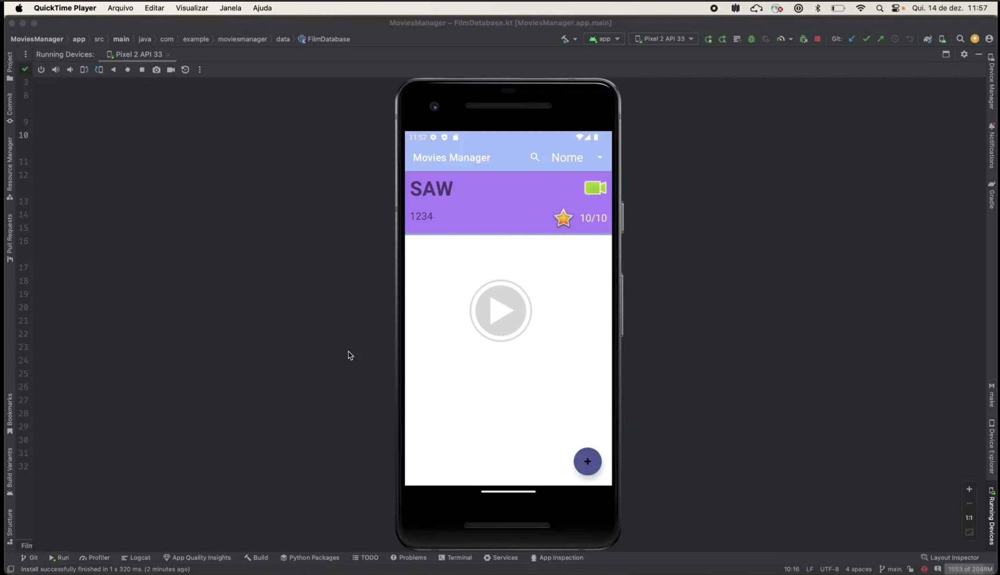
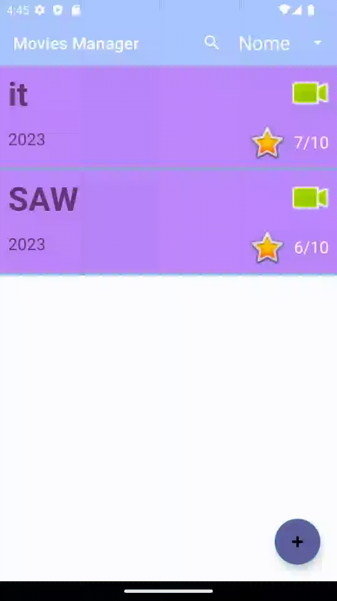
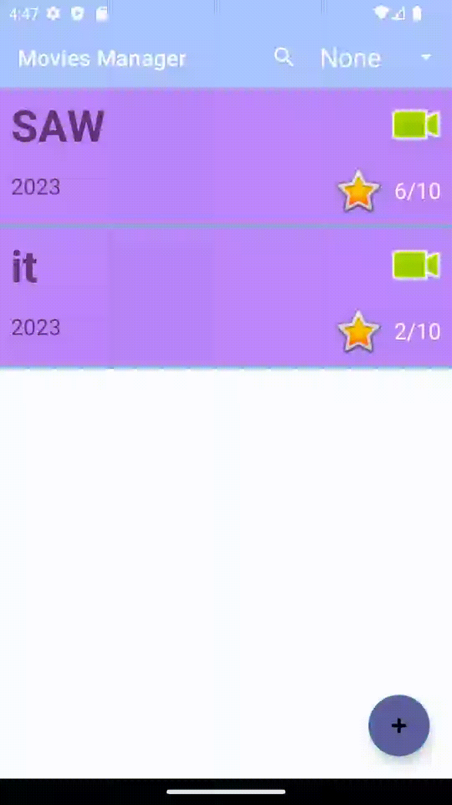

# MoviesManager

MoviesManager é um aplicativo de gerenciamento de filmes de código aberto que permite aos usuários rastrear seus filmes favoritos. O aplicativo é escrito em Kotlin e está disponível neste repositório.

### [<h2>Video de demonstração do app</h2>](https://drive.google.com/file/d/1sRAzowoGD-l9a4vgOJfGEYIgzG_sRP8C/view?usp=sharing)
### 

### Adiciona novo filme

### Remove novo filme

### Detalhes do filme

### Editar filme

### Ordena filmes

### Busca filmes

### Recursos
Gerenciamento de filmes: Os usuários podem adicionar, editar e excluir filmes de sua coleção. Eles também podem visualizar informações sobre os filmes, como título, ano e gênero.

### Uso

O aplicativo exibirá a tela principal do aplicativo. Esta tela mostra uma lista de todos os filmes em sua coleção.

### Contribuições

O MoviesManager é um projeto de código aberto, então todos são bem-vindos a contribuir. Se você tiver alguma sugestão ou correção, sinta-se à vontade para abrir uma issue no repositório do GitHub do projeto.
